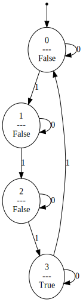

# DFA

A simple python implementation of a DFA. 

[](https://cloud.drone.io/mvcisback/dfa)
[](https://mvcisback.github.io/dfa)
[](https://codecov.io/gh/mvcisback/dfa)
[](https://badge.fury.io/py/dfa)
[](https://opensource.org/licenses/MIT)

<!-- markdown-toc start - Don't edit this section. Run M-x markdown-toc-generate-toc again -->
**Table of Contents**

- [Installation](#installation)
- [Usage](#usage)
    - [Membership Queries](#membership-queries)
    - [Transitions and Traces](#transitions-and-traces)
    - [Non-boolean output alphabets](#non-boolean-output-alphabets)
    - [Moore Machines](#moore-machines)
    - [Composition](#composition)
    - [DFA <-> Dictionary](#dfa---dictionary)
    - [Computing Reachable States](#computing-reachable-states)
    - [Sampling Paths](#sampling-paths)
    - [Running interactively (Co-Routine API)](#running-interactively-co-routine-api)
    - [Visualizing DFAs](#visualizing-dfas)

<!-- markdown-toc end -->


**Features:**

1. State can be any Hashable object.
2. Alphabet can be any finite sequence of Hashable objects.
3. Designed to be immutable and hashable (assuming components are
   immutable and hashable).
4. Design choice to allow transition map and accepting set to be
   given as functions rather than an explicit `dict` or `set`.

# Installation

If you just need to use `dfa`, you can just run:

`$ pip install dfa`

For developers, note that this project uses the
[poetry](https://poetry.eustace.io/) python package/dependency
management tool. Please familarize yourself with it and then
run:

`$ poetry install`

# Usage

The `dfa` api is centered around the `DFA` object. 

By default, the `DFA` object models a `Deterministic Finite Acceptor`,
e.g., a recognizer of a Regular Language. 

**Example Usage:**
```python
from dfa import DFA

dfa1 = DFA(
    start=0,
    inputs={0, 1},
    label=lambda s: (s % 4) == 3,
    transition=lambda s, c: (s + c) % 4,
)

dfa2 = DFA(
    start="left",
    inputs={"move right", "move left"},
    label=lambda s: s == "left",
    transition=lambda s, c: "left" if c == "move left" else "right",
)
```

## Membership Queries

```python
assert dfa1.label([1, 1, 1, 1])
assert not dfa1.label([1, 0])

assert dfa2.label(["move right"]*100 + ["move left"])
assert not dfa2.label(["move left", "move right"])
```

## Transitions and Traces

```python
assert dfa1.transition([1, 1, 1]) == 3
assert list(dfa1.trace([1, 1, 1])) == [0, 1, 2, 3]
```

## Non-boolean output alphabets

Sometimes, it is useful to model an automata which can label a word
using a non-Boolean alphabet. For example, `{True, False, UNSURE}`.

The `DFA` object supports this by specifying the output alphabet.

```python
UNSURE = None

def my_labeler(s):
    if s % 4 == 2:
       return None
    return (s % 4) == 3


dfa3 = DFA(
    start=0,
    inputs={0, 1},
    label=my_labeler,
    transition=lambda s, c: (s + c) % 4,
    outputs={True, False, UNSURE},
)
```

**Note:** If `outputs` is set to `None`, then no checks are done that
the outputs are within the output alphabet.

```python
dfa3 = DFA(
    start=0,
    inputs={0, 1},
    label=my_labeler,
    transition=lambda s, c: (s + c) % 4,
    outputs=None,
)
```

## Moore Machines

Finally, by reinterpreting the structure of the `DFA` object, one can
model a Moore Machine. For example, in 3 state counter, `dfa1`, the
Moore Machine can output the current count.

```python
assert dfa1.transduce(()) == ()
assert dfa1.transduce((1,)) == (False,)
assert dfa1.transduce((1, 1, 1, 1)) == (False, False, False, True)
```

## Composition

`DFA` objects can be combined in four ways:

1. (Synchronous) Cascading Composition: Feed outputs of one `DFA` into another.

```python
mod_5 = DFA(
    start=0,
    label=lambda s: s,
    transition=lambda s, c: (s + c) % 5,
    inputs={0, 1},
    outputs={0, 1, 2, 3, 4},
)
eq_0 = DFA(
    start=0,
    label=lambda s: s == 0,
    transition=lambda s, c: c,
    inputs={0, 1, 2, 3, 4},
    outputs={True, False}
)

eq_0_mod_5 = eq_0 << mod_5
assert eq_0_mod_5.label([0, 0, 0, 0])
assert not eq_0_mod_5.label([0, 1, 0, 0, 0])
```

Note that we use Moore Machine semantics (as opposed to Mealy).  Thus
`eq_0`'s input is determined by `mod_5`'s state *before* seeing the
input. Thus, the following holds.

```python
assert not eq_0_mod_5.label([1, 1, 1, 1, 1])
assert eq_0_mod_5.label([1, 1, 1, 1, 1, 0])
```

2. (Synchronous) Parallel Composition: Run two `DFA`s in parallel.

```python
parity = DFA(
    start=0, inputs={0, 1}, label=lambda s: s,
    transition=lambda s, c: (s + c) & 1,
)

self_composed = parity | parity

assert self_composed.label([(0, 0), (1, 0)]) == (1, 0)
```

**Note** Parallel composition results in a `DFA` with
`dfa.ProductAlphabet` input and outputs.

3. (Synchronous) Parallel Composition with shared inputs:

```python
from dfa.utils import tee

self_composed2 = parity | parity

assert self_composed2.label([0, 1, 0]) == (1, 1)
```

4. Boolean combinations (only works for Boolean output DFAs)

```python
dfa_neg     = ~dfa_1         # Complement of acepting set.
dfa_1_or_2  = dfa_1 | dfa_2  # Union of accepting sets. 
dfa_1_and_2 = dfa_1 & dfa_2  # Intersection of accepting sets.
dfa_1_xor_2 = dfa_1 ^ dfa_2  # Symmetric difference of accepting sets.
```

## Language Queries

Utility functions are available for testing if a language:

1. Is empty: `utils.find_word`
2. Is equivilent to another language: `utils.find_equiv_counterexample`
3. Is a subset of a another language: `utils.find_subset_counterexample`

These operate by returning `None` if the property holds, i.e.,
`lang(dfa1) = ∅, lang(dfa1) ≡ lang(dfa2), lang(dfa1) ⊆ lang(dfa2)`, and
returning a counterexample `Word` otherwise.

## DFA <-> Dictionary

Note that `dfa` provides helper functions for going from a dictionary
based representation of a deterministic transition system to a `DFA`
object and back.

```python
from dfa import dfa2dict, dict2dfa

# DFA encoded a nested dictionaries with the following
# signature.
#     <state>: (<label>, {<action>: <next state>})

dfa_dict = {
    0: (False, {0: 0, 1: 1}),
    1: (False, {0: 1, 1: 2}),
    2: (False, {0: 2, 1: 3}), 
    3: (True, {0: 3, 1: 0})
}

# Dictionary -> DFA
dfa = dict2dfa(dfa_dict, start=0)

# DFA -> Dictionary
dfa_dict2, start = dfa2dict(dfa)

assert (dfa_dict, 0) == (dfa_dict2, start)
```

## Computing Reachable States

```python
# Perform a depth first traversal to collect all reachable states.
assert dfa1.states() == {0, 1, 2, 3}
```

## Sampling Paths

Often times, it is useful to sample a path between two states, say `a`
and `b`. `dfa` supports this using `dfa.utils.paths`. This function
returns a generator of words, `w`, such that `dfa.transition(w,
start=b) == a`. For example:


```python
from dfa.utils import paths

access_strings = paths(
    dfa1, 
    start=0,
    end=1,  # Optional. If not specified returns all paths
            # starting at `start`.
    max_length=7,  #  Defaults to float('inf')
    randomize=True,  #  Randomize the order. Shorter paths still found first.
)

for word in access_strings:
    assert dfa1.transition(word, start=0) == 1
```

## Running interactively (Co-Routine API)

`dfa` supports interactively stepping through a `DFA` object via
co-routines. This is particularly useful when using DFA in a control
loop. For example, the following code counts how many `1`'s it takes
to advance `dfa1`'s state back to the start state.

```python

machine = dfa1.run()

next(machine)
state = None

count = 0
while state != dfa1.start:
    count += 1
    state = machine.send(1)
```

## Visualizing DFAs

`dfa` optionally supports visualizing DFAs using graphviz. To use this
functionality be sure to install `dfa` using with the `draw` option:

```python
pip install dfa[draw]
```

or 

```python
poetry install -E draw
```

Then one can simply use `dfa.draw.write_dot` to write a `.dot` file
representing the DFA. This `.dot` file can be rendered using any
graphviz supporting tool.

```python
from dfa.draw import write_dot

write_dot(dfa1, "path/to/dfa1.dot")
```

Using the `dot` command in linux results in the following rendering of `dfa1`.

`$ dot -Tsvg path/to/dfa1.dot > dfa1.svg`

<figure>
  
  <figcaption>
    Visualization of dfa1 using graphviz.
  </figcaption>
</figure>
